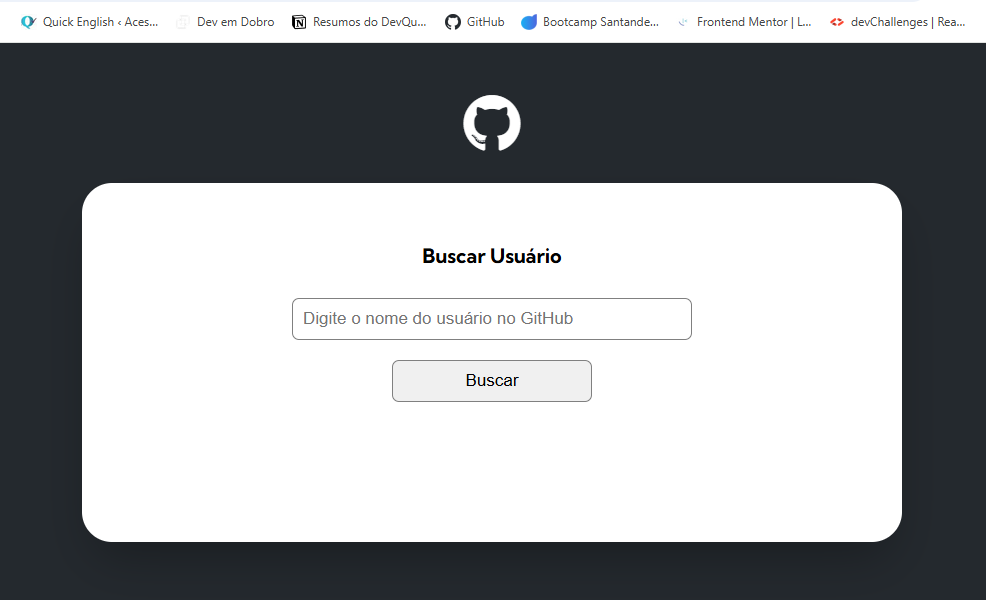

# 🔍 Github API - Buscando Usuários com Fetch

Este projeto tem como objetivo consumir a **API pública do GitHub** e exibir informações de usuários cadastrados na plataforma, como nome, avatar, imagem do perfil, eventos, repositórios públicos, seguidores etc.  
O foco está no uso do **JavaScript** para realizar requisições com **fetch()**, além de HTML e CSS para a estrutura e o design da página.

---

## 🚀 Tecnologias Utilizadas

- **HTML5** → estrutura do projeto  
- **CSS3** → estilização e layout  
- **JavaScript (Fetch API)** → consumo da API do GitHub  

---

## 🧭 Funcionalidades

- Buscar qualquer usuário cadastrado no GitHub  
- Exibir informações básicas do perfil (foto, nome, bio, seguidores, etc.)   
- Exibir os repositórios públicos do usuário 

---

## 🖼️ Prévia do Projeto

| Página Inicial | Resultado da Busca |
|-----------------|-------------------|
|  |  |

---

## 📚 Aprendizados

Durante o desenvolvimento deste projeto, foram reforçados conceitos como:
- Manipulação do DOM com JavaScript  
- Requisições assíncronas com **fetch()**  
- Tratamento de erros e respostas da API  
- Estruturação de layout com CSS  

---

## 🧑‍💻 Autor

**Rafaella Pirani dos Santos**  
📎 [LinkedIn](https://www.linkedin.com/in/rafaella-pirani-03a735a7) • [GitHub](https://github.com/rafaellapirani)  

